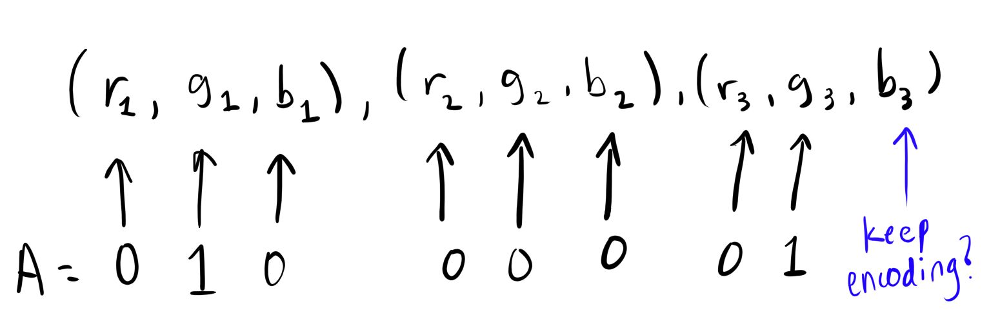

# stegano

stegano is an educational steganography tool aimed at teaching the user how steganography works by outputting changes made to an image as binary data is injected into it.

### prereqs
`pip3 install Pillow`
### usage 

`python3 stegano.py [-h] [-d] [-e message] image`

# example 
python stegano.py ./encoding.jpg -e Hello_here_this_is_my_message 
python stegano.py ./_news.png -d

## how it works 

### encoding 

stegano takes in an image and some text and injects the text into the image by modifying the individual pixels. 

A pixel looks like this:

`(r, g, b)`

It's just a RGB array. The first 5 pixels in an image could look something like this:

`[(86, 127, 179), (87, 128, 179), (90, 132, 182), (92, 135, 185), (96, 137, 188)]`

To inject some text into the image, we want to get the 8-bit binary representation of each letter in the string we want to include. Say for example we want to put the letter "A" into an image. If it had the above pixel layout, this would be the process: 

1. First convert A to binary (`01000001`)
2. For every bit, we want to modify a value in the RGB pixel array. If the bit is 0, we make the value that maps to it's location in the pixel array even, and if the bit is 1, we make it odd, both by adding or subtracting 1 from that specific value. 
3. There are three values in a pixel array. We are changing 3 pixels at a time to cover all 8 bits from the letter we are injecting, but that means there is one value at the end of the pixel array unaccounted for. This number will be made even if you are going to keep encoding the image, and odd if you are done. 

So if our image had the following arrangement for the first 3 pixels

[(86, 127, **179**), (**87**, 128, **179**), (90, **132**, **182**)]

we could inject "A" by changing the things in bold by subtracting 1 from it.

You can map the bits from A to the pixels as follows:

Now our pixels will look like this after a single "A" has been injected:

`[(86, 127, 178), (86, 128, 178), (90, 131, 181)]`

### decoding 

Decoding should now be pretty trivial. If we look at the steps above we can possibly extract some text by reversing the algorithm. stegano reads up to the first 9th value in a set of pixels that is odd and then begins to attempt decoding. It will figure out what binary data is represented by these pixels by knowing all even numbers represent a 0 and all odd numbers represent a 1, then translating that to it's correct ASCII value. 

### before & after

Here's an image before encoding:

This image has around 83,000 pixels. After modifying about 81,000 of those pixels to inject 27,000 letters into the image, this is what the image looks like:

